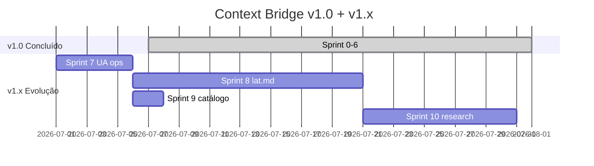

# Plano de Sprints — Context Bridge

**Objetivo v1.0:** entregar ponte completa Understand Anything → Engram (CLI + sync + enrich + MCP + skill). **Concluído em v1.0.0.**

**Objetivo v1.x:** evoluir multi-fonte (lat.md), operacionalizar workflow UA, pesquisar adapters Orbit KG/Potpie, expandir catálogo.

**Escopo permanente fora:** executar `/understand`, dashboard UA, sync bidirecional Engram → grafo.

---

## Visão do produto

### v1.0 (entregue)

```
context-bridge (CLI + MCP)
├── doctor       → Engram + UA graph OK?
├── sync         → grafo → mem_save (full / incremental)
├── enrich       → mem_search + nós do grafo
├── suggest      → payloads sem gravar
├── install      → skill + checks
└── mcp          → 4 tools para agents
```

### v1.x (planejado)

```
context-bridge (CLI + MCP)
├── sources/           → UA | lat-md | (Orbit/Potpie v1.2)
├── graph import       → lat-md → .context-bridge/lat-graph.json
├── workflows/         → sync-after-understand, enrich-before-task
├── research/          → watchlist, go/no-go, ADRs
└── (sync/enrich inalterados sobre KnowledgeGraph)
```

**Definition of Done v1.0:** ver [DESENVOLVIMENTO.md](DESENVOLVIMENTO.md#definition-of-done-projeto-v10)  
**Definition of Done v1.x:** ver [DESENVOLVIMENTO.md](DESENVOLVIMENTO.md#definition-of-done-v1x)

---

## Índice das sprints — v1.0 (concluídas)

| Sprint | Arquivo | Meta | Status |
|--------|---------|------|--------|
| 0 | [sprint-0-fundacao.md](sprints/sprint-0-fundacao.md) | Scaffold, CLI, pytest, doctor stub | concluída |
| 1 | [sprint-1-leitor-grafo.md](sprints/sprint-1-leitor-grafo.md) | Parser knowledge-graph.json + queries | concluída |
| 2 | [sprint-2-cliente-engram.md](sprints/sprint-2-cliente-engram.md) | Cliente HTTP/CLI Engram | concluída |
| 3 | [sprint-3-sync.md](sprints/sprint-3-sync.md) | Sync full + incremental | concluída |
| 4 | [sprint-4-enrich.md](sprints/sprint-4-enrich.md) | Enrich + suggest | concluída |
| 5 | [sprint-5-mcp-skill.md](sprints/sprint-5-mcp-skill.md) | MCP + skill + hooks | concluída |
| 6 | [sprint-6-release.md](sprints/sprint-6-release.md) | CI, docs, release v1.0 | concluída — **v1.0.0** |

---

## Índice das sprints — v1.x (evolução)

| Sprint | Arquivo | Meta | Versão | Passo | Status |
|--------|---------|------|--------|-------|--------|
| 7 | [sprint-7-operacionalizacao-ua.md](sprints/sprint-7-operacionalizacao-ua.md) | Workflow UA canônico, smoke, métricas sync | v1.0.1 | 1 | concluída — **v1.0.1** |
| 8 | [sprint-8-adapter-lat-md.md](sprints/sprint-8-adapter-lat-md.md) | Camada `sources/` + adapter lat.md | v1.1.0 | 2 | concluída — **v1.1.0** |
| 9 | [sprint-9-catalogo-watchlist.md](sprints/sprint-9-catalogo-watchlist.md) | Catálogo lat.md/Potpie + watchlist | v1.1.1 | 4 (+ início 3) | concluída — **v1.1.1** |
| 10 | [sprint-10-research-adapters.md](sprints/sprint-10-research-adapters.md) | Spikes Orbit KG/Potpie + ADRs + adapter v1.2 | v1.2.0 | 3 | concluída — **v1.2.0** (ambos os spikes: defer) |

**Total v1.x estimado:** ~5–8 semanas após v1.0.0

---

## Roadmap — quatro passos

### Passo 1 — Curto prazo: consolidar UA como fonte primária

**Sprint 7 · v1.0.1 · 3–5 dias**

- Workflows `sync-after-understand` e `enrich-before-task`
- Smoke test com `enrich`
- Métricas no relatório de sync
- Skill e hooks alinhados

### Passo 2 — Médio prazo: adapter lat.md → knowledge-graph.json

**Sprint 8 · v1.1.0 · 2–3 semanas**

- `context_bridge/sources/` (UA + lat-md)
- `graph import lat-md` → `.context-bridge/lat-graph.json`
- `config/graph-source.yaml`
- `docs/SOURCES.md` + ADRs 002/003

### Passo 3 — Pesquisa contínua: Orbit KG + Potpie

**Sprint 9 (início) + Sprint 10 · v1.2.0 · 1–2 semanas**

- Watchlist quinzenal: [research/watchlist.md](research/watchlist.md)
- Go/no-go: [research/go-no-go-adapters.md](research/go-no-go-adapters.md)
- Spikes + ADRs 004/005
- Adapter opcional se go

### Passo 4 — Catálogo: lat.md e Potpie

**Sprint 9 · v1.1.1 · 1–2 dias** (paralelo à Sprint 8)

- `catalog/ai-agents/knowledge/lat-md.md`, `potpie.md`
- Entradas em `manifests/projects.json`
- Links cruzados UA ↔ Context Bridge

---

## Cronograma resumido



| Sprint | Duração | Entregável acumulado |
|--------|---------|----------------------|
| 0–6 | ~22–28d | **v1.0.0** — ponte UA → Engram completa |
| 7 | 3–5d | **v1.0.1** — workflow operacional documentado |
| 8 | 2–3 sem | **v1.1.0** — lat.md como segunda fonte |
| 9 | 1–2d | **v1.1.1** — catálogo + watchlist |
| 10 | 1–2 sem | **v1.2.0** — spikes + adapter(s) ou ADR defer |

---

## Dependências entre sprints

```
v1.0 (concluído)
S0 → S1 → S2 → S3 → S4 → S5 → S6 (v1.0.0)

v1.x (planejado)
S6 ──► S7 (operacionalização UA)
         ├─► S8 (adapter lat.md) ──► S10 (research + v1.2)
         └─► S9 (catálogo + watchlist) ──► S10
```

S9 pode **correr em paralelo** com S8 (sem dependência de código). S10 exige S8 (`sources/`) e S9 (watchlist).

---

## Matriz de integração

| Integração | Sprint | Backend | v1.x |
|------------|--------|---------|------|
| UA graph read | 1 | `.understand-anything/*.json` | Primário (S7) |
| lat.md graph | 8 | `lat.md/` → `.context-bridge/lat-graph.json` | Segunda fonte |
| Orbit KG / Potpie | 10 | TBD pós-spike | Opcional v1.2 |
| Engram HTTP/CLI | 2 | `engram serve` / CLI | Inalterado |
| Sync rules | 3, 8 | `sync-rules.yaml` + `graph_ref` | Estendido S8 |
| MCP Cursor | 5 | FastMCP stdio | Inalterado |
| Catálogo pai | 6, 9 | `manifests/projects.json` | +lat.md, +potpie S9 |
| Watchlist | 9, 10 | `docs/research/` | Contínuo |

---

## Riscos e mitigações

| Risco | Impacto | Mitigação | Sprint |
|-------|---------|-----------|--------|
| Schema UA muda | Parser quebra | Version field + fixtures | 1, 7 |
| lat.md schema evolui | Adapter quebra | Fixtures versionadas | 8 |
| Orbit/Potpie opaco | Adapter inviável | Go/no-go + ADR defer | 10 |
| Duplicata UA + lat no Engram | Ruído | `topic_key` + `graph_ref` distintos | 8 |
| Scope creep v1.2 | Atraso | Máx. 1 adapter por release | 10 |

---

## Backlog pós-v1.2

- Merge UA + lat no mesmo grafo (v1.3)
- Suporte `/understand-knowledge` (wikis Karpathy)
- Hook git post-commit integrado com UA `--auto-update`
- `context-bridge watch` — file watcher no grafo
- Cache local SQLite para enrich offline
- Plugin nativo Engram ou UA (upstream)
- Integração Agent Reach Tech (research → codebase context)

Itens movidos do backlog v1.0:

- ~~Suporte wikis Karpathy~~ → backlog v1.3 (após multi-fonte)
- ~~Integração Agent Reach~~ → backlog v1.2+ (watchlist S9/S10 cobre pesquisa)

---

## Como marcar progresso

1. Em cada arquivo de sprint, marque `[x]` nos critérios de aceite ao concluir.
2. Atualize a coluna **Status** neste índice quando a sprint fechar.
3. Registre versão em `CHANGELOG.md` e `pyproject.toml`.
4. Atualize [watchlist](research/watchlist.md) quando decisões de adapter mudarem.

| Sprint | Status |
|--------|--------|
| 0–6 | concluídas — v1.0.0 |
| 7 | concluída — v1.0.1 |
| 8 | concluída — v1.1.0 |
| 9 | concluída — v1.1.1 |
| 10 | concluída — v1.2.0 |

---

## Referências

- [DESENVOLVIMENTO.md](DESENVOLVIMENTO.md) — princípios, DoD, tipos de memória
- [ARCHITECTURE.md](ARCHITECTURE.md) — módulos e fluxos atuais
- [research/watchlist.md](research/watchlist.md) — candidatos a adapter
- [research/go-no-go-adapters.md](research/go-no-go-adapters.md) — critério adopt/defer/reject
